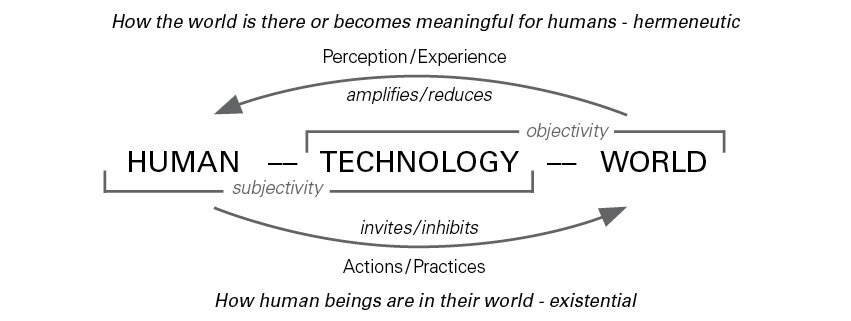
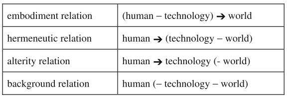
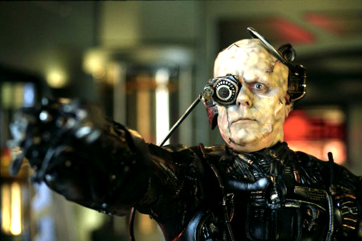
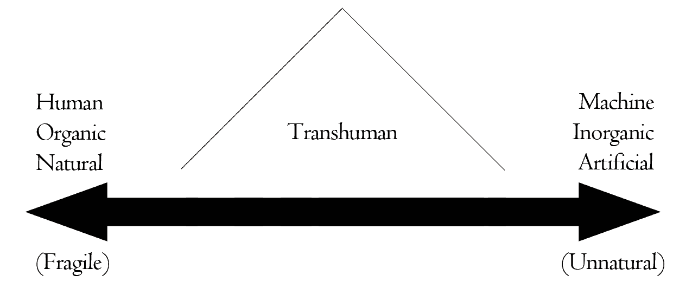

```{r presentationsetup, include=FALSE}
knitr::opts_chunk$set(echo = FALSE)
library(xaringan)
library(xaringanExtra)
library(fontawesome)
library(RefManageR)

# Xaringan extras
xaringanExtra::use_extra_styles(
  hover_code_line = TRUE,         #<<
  mute_unhighlighted_code = TRUE  #<<
)
xaringanExtra::use_slide_tone() # unmute when publishing
```

class: right, bottom, inverse

background-image: url(https://media.giphy.com/media/CdhxVrdRN4YFi/source.gif)
background-position: center
background-color: #000
background-size: contain

<!-- <br /><h3 style="album">Destroyer - Kaputt (2011)</h3> -->

---
layout: true

<div class="my-header"></div>
<div class="my-footer"><span>Dr. Ryan Straight - Blurring Borders between Technology and Self</span></div> 


---
class: left, middle, inverse

# Blurring Borders between Technology and Self

## Dr. Ryan Straight<br />Applied Computing<br />CAST

### Western Engineering Science & Technology (WEST) Club

---

## Topics for today

+ Technology relationships
+ Cyborgs
+ Transhumanism
+ Ethics

---

# Postphenomenology

The biggest word for today.

.left-column[

<div style="width:100%;height:0;padding-bottom:85%;position:relative;"><iframe src="https://giphy.com/embed/DKxLpuSel0izK" width="100%" height="100%" style="position:absolute" frameBorder="0" class="giphy-embed" allowFullScreen></iframe></div><p><a href="https://giphy.com/gifs/stephen-colbert-sesame-street-aaaaand-its-230am-im-crashing-now-DKxLpuSel0izK">via GIPHY</a></p>

]

.right-column[

]


---

## It's about relations~~hips~~



There is a relation between the subject and the object that comes about mediated by technology. Technology is a medium which mutually constitutes the subject and the object.

--

+ Intentionality: makes visible the "inextricable connections" between humans and the world

---

## **Mediated** intentionality

+ Human intentionality is **mediated** by technology
+ Binoculars, thermometers, A/C, etc.

<div style="width:100%;height:0;padding-bottom:45%;position:relative;"><iframe src="https://giphy.com/embed/xT9IgDgtxSWF27spgI" width="100%" height="100%" style="position:absolute" frameBorder="0" class="giphy-embed" allowFullScreen></iframe></div><p><a href="https://giphy.com/gifs/NASA-space-nasa-xT9IgDgtxSWF27spgI">via GIPHY</a></p>

---

## Cyborg relations

+ When intentionality goes **both** ways, or...
+ when they **merge**


<div style="width:100%;height:0;padding-bottom:45%;position:relative;"><iframe src="https://giphy.com/embed/2gjbGwII4sCiB5Seol" width="100%" height="100%" style="position:absolute" frameBorder="0" class="giphy-embed" allowFullScreen></iframe></div><p><a href="https://giphy.com/gifs/abcnetwork-abc-cyborg-2gjbGwII4sCiB5Seol">via GIPHY</a></p>

???

All the relations up to this point are external, right? But what about when they get so close to the person that they're inside or reflexive to the person.

---

## Composite relation

+ Related to **hermenutic**
+ Double intentionality:
  + technology toward **its** world
  + us toward the result
  
<div style="width:100%;height:0;padding-bottom:40%;position:relative;"><iframe src="https://giphy.com/embed/cVRV2RVEaM8Fi" width="100%" height="100%" style="position:absolute" frameBorder="0" class="giphy-embed" allowFullScreen></iframe></div><p><a href="https://giphy.com/gifs/blade-runner-cVRV2RVEaM8Fi">via GIPHY</a></p>
  
---

## Hermenutic

human -> (technology - world)

## Composite

human -> (technology -> world)

--

Examples?

???

We see how the technology sees the world, not just the result of the technology, like an X-ray.

+ Radio telescopes
+ IR cameras

---


???

This is an infrared photograph of a cemetery. It makes visible to our eyes what only the technology can "see." And there may or may not be a ghost here. I'm no Zak Bagens, though.

---

## Alteration relation

+ Self-reflexive
+ Technology can alter the world.
+ `I -> technology -> I`

<div style="width:100%;height:0;padding-bottom:45%;position:relative;"><iframe src="https://giphy.com/embed/xUPGcqRmfGLdE9azD2" width="100%" height="100%" style="position:absolute" frameBorder="0" class="giphy-embed" allowFullScreen></iframe></div><p><a href="https://giphy.com/gifs/pbsdigitalstudios-cartoon-genetics-xUPGcqRmfGLdE9azD2">via GIPHY</a></p>

???

When the technology alters us as a living being, not inserting technology inside yourself. So includes growing organs on chips, testing sperm at home, selecting sex, which we'll get back to in a bit.

---

## Augmentation relation

<div style="width:100%;height:0;padding-bottom:45%;position:relative;"><iframe src="https://giphy.com/embed/xT4uQtKop5Aze5tGJa" width="100%" height="100%" style="position:absolute" frameBorder="0" class="giphy-embed" allowFullScreen></iframe></div><p><a href="https://giphy.com/gifs/reality-hyper-keiichi-xT4uQtKop5Aze5tGJa">via GIPHY</a></p>

???

Technologies can also add an extra layer of being directed at the world. Google Glass (even defunct) helps you see the world and you see information about the world simultaneously. As you can see from the diagram, there is the combination of the self and the technology (though the physical proximity can vary, like between augmented reality glasses and using an app) which is then directed at the world. Then, on top of that, you see a combination of the technology and the world. The diagram for this is complicated.

---

## Cyborg intentionality

+ **Mediated** and reflexive intentionality
+ Remember the relations?


???

Feels like we're missing something, though, right? Where's the implanted chips? The artificial heart valves? The prosthetic limbs? Well, that's the...

---

## Fusion relation

`(I/Technology) -> World`

<div style="width:100%;height:0;padding-bottom:45%;position:relative;"><iframe src="https://giphy.com/embed/PhCkNSSDNXNoR43P80" width="100%" height="100%" style="position:absolute" frameBorder="0" class="giphy-embed" allowFullScreen></iframe></div><p><a href="https://giphy.com/gifs/doctorwho-doctor-who-dr-series-12-PhCkNSSDNXNoR43P80">via GIPHY</a></p>

???

So all of those are cyborg relations, as it's a category, but the one we're really thinking about when we say "cyborg" is the Fusion relation.

You can see the technology and the self have merged to the point that they are indistinguishable in any meaningful sense (this does not mean they are physically permanently fused, however). This could be something like a cochlear implant, artificial body parts like heart valves, even pacemakers. Many women could fall into this category if they have an IUD for birth control. If you have one, you have implanted a piece of technology into your body that allows you to control an aspect of your existence (your fertility). How about someone that puts a magnet under the skin in their fingertip? They can literally feel magnetic fields. It's called "body hacking." An RFID chip in your hand to unlock your car or your house, for example. May seem extreme still but you can order the kits online and have them done for next to nothing. 

So we've identified how we relate to technology and how it mediates our experience of the world, and we've identified what we think of when we think "cyborg," so how about we try to define it?

---

## What is a cyborg?

"Cybernetic organism"

<div style="width:100%;height:0;padding-bottom:45%;position:relative;"><iframe src="https://giphy.com/embed/mXrPky9Gy3wac" width="100%" height="100%" style="position:absolute" frameBorder="0" class="giphy-embed" allowFullScreen></iframe></div><p><a href="https://giphy.com/gifs/film-blade-runner-sean-young-mXrPky9Gy3wac">via GIPHY</a></p>

---

## Cybernetic

Cybernetic(s): The theoretical study of communication and control processes in biological, mechanical, and electronic systems, especially the comparison of these processes in biological and artificial systems.

---

## More definitions

A person whose physiological functioning is aided by or dependent upon a mechanical or electronic device

<div style="width:100%;height:0;padding-bottom:25%;position:relative;"><iframe src="https://giphy.com/embed/wmdFxigBfmOU8" width="100%" height="100%" style="position:absolute" frameBorder="0" class="giphy-embed" allowFullScreen></iframe></div>

--

### Haraway
Non-naturalist human

--

### Verbeek
Border-blurring entity, uniting both human and nonhuman elements

---

## When did we become cyborgs?

+ Have we always been?
+ Is humanity an invention of technology or the other way around

<div style="width:100%;height:0;padding-bottom:45%;position:relative;"><iframe src="https://giphy.com/embed/y7Vdxx9BTDbeo" width="100%" height="100%" style="position:absolute" frameBorder="0" class="giphy-embed" allowFullScreen></iframe></div><p><a href="https://giphy.com/gifs/days-caveman-y7Vdxx9BTDbeo">via GIPHY</a></p>

???

So Bernard Stiegler says humanity is an invention of technology, not the other way around. I want you to think about that as we keep going. It's pretty clear we can say that technology scaffolded our ability to grow as humans, both biologically and culturally through things like art and agriculture, but couldn't we equally say the harnessing of fire is what led to our quote-unquote "humanity" and higher-order thinking because it provided us with warmth, made us want to take shelter because of that warmth, allowed us to cook foods and get the various nutrition that you can only get with cooked food? More interesting questions.

---

## Sorite's paradox

Where do we draw the line?

<div style="width:100%;height:0;padding-bottom:40%;position:relative;"><iframe src="https://giphy.com/embed/11ZZW6J4lyS26Q" width="100%" height="100%" style="position:absolute" frameBorder="0" class="giphy-embed" allowFullScreen></iframe></div><p><a href="https://giphy.com/gifs/maudit-maudit-so-pretty-lawrence-of-arabia-11ZZW6J4lyS26Q">via GIPHY</a></p>

???

And here is where we start getting into transhumanism and ethics, right? We're going to consider humanity a spectrum (and we'll come back to that in a minute after we set the stage).

Let's talk about Sorite's paradox for a second. Originates with the sand dune example: "The "heap" of sand. Remove one grain of sand, it's still a heap. Repeat until one grain is left. When did the heap change to a non-heap? Is that one grain a heap?"

The reverse is true: start with one grain of sand, and keep adding individual grains. When does it become a heap?

---

## Replacement?

**Think about your computer**

--

+ You purchased every piece separately
--

+ You've replaced every part over time
--

+ Is it the same computer?
--

+ If yes, what would make it different?
--

+ If no, when did that happen?
--

+ The issue becomes **metaphysical**

<div style="width:100%;height:0;padding-bottom:39%;position:relative;"><iframe src="https://giphy.com/embed/gY5sEujrJbCve" width="100%" height="100%" style="position:absolute" frameBorder="0" class="giphy-embed" allowFullScreen></iframe></div><p><a href="https://giphy.com/gifs/meta-gY5sEujrJbCve">via GIPHY</a></p>

???

Let's extend that to technology.

---

## Example: The Doctor

But *is* it?

<div style="width:100%;height:0;padding-bottom:45%;position:relative;"><iframe src="https://giphy.com/embed/3o751Y2mQnH1lwDfVe" width="100%" height="100%" style="position:absolute" frameBorder="0" class="giphy-embed" allowFullScreen></iframe></div><p><a href="https://giphy.com/gifs/bbcamerica-doctor-who-twelfth-3o751Y2mQnH1lwDfVe">via GIPHY</a></p>

???

So, we might say that it's consciousness that determines the human, in this case, right? Maybe that's a good way of thinking about it.

If every cell in The Doctor's body regenerates (presumably meaning it changes into quote-unquote "new" cells, meaning *different* cells, but there's no lapse or change in consciousness, ie The Doctor retains all memroy) is it the same doctor?

How about the transporter in the Star Trek universe? If that person is atomized and reconstructed, is there a lapse in consciousness? Is it the same person after the transport? 

Here's a terrifying thought: what if that happens every time we go to sleep? If persistent consciousness is a definition for humanity, is "the person" we were when we went to sleep gone forever and we're just a new version with all the same memories? 

Interesting questions, huh?

---

## Neuroreconstruction

Time for a thought experiment:

+ Child suffers injury and is essentially brain-dead.
+ New procedure: “neuroreconstruction”
+ \~6 months to grow “new” brain

--

**But**:

+ Child loses all memories, _possibly_ will have different attitude/temperament
+ Needs re-educated like a newborn, will catch up with peers in ~4 years
+ Is it the same child?

---

## Cybernetic vision

+ Stem-cell repairs macular degeneration
+ What if cells were synthetic?
+ What if repaired via electrodes?
+ What if vision were replaced with artificial stimulation?

<div style="width:100%;height:0;padding-bottom:42%;position:relative;"><iframe src="https://giphy.com/embed/X9trzKpgRY1N1QsGim" width="100%" height="100%" style="position:absolute" frameBorder="0" class="giphy-embed" allowFullScreen></iframe></div><p><a href="https://giphy.com/gifs/cheese-stilton-picking-X9trzKpgRY1N1QsGim">via GIPHY</a></p>

---

## The question becomes: **when** do we care?

+ Augmented humans?
+ Non-human mode of relationship and reaction or response may affect a person at a deep and pervasive level
+ “That’s unnatural!”

<div style="width:100%;height:0;padding-bottom:42%;position:relative;"><iframe src="https://giphy.com/embed/1xNmjvYS9is47QDzQo?video=0" width="100%" height="100%" style="position:absolute" frameBorder="0" class="giphy-embed" allowFullScreen></iframe></div><p><a href="https://giphy.com/gifs/brain-look-around-you-ebe-1xNmjvYS9is47QDzQo">via GIPHY</a></p>

---

## What's "worse"

+ Biological human augmented beyond "human" recognition
+ AI with no corporeal form
+ Replicants

<div style="width:100%;height:0;padding-bottom:42%;position:relative;"><iframe src="https://giphy.com/embed/LMbsWqpH1MyodBeP6R" width="100%" height="100%" style="position:absolute" frameBorder="0" class="giphy-embed" allowFullScreen></iframe></div><p><a href="https://giphy.com/gifs/netflix-really-sure-hmmm-LMbsWqpH1MyodBeP6R">via GIPHY</a></p>

---

## Posthuman

### vs

## Transhuman

???

The major difference between the two is that Posthumanism puts a lot of emphasis on systems and their components, while transhumanism fully focuses on changing the form and abilities of the present human body. Another difference is that posthumans place importance on information and system theories (cybernetics) and their main relationship is with digital technology, while this is not the same for transhumans.

The difference is right there in the prefixes: post (after) vs trans (meaning across, beyond).

---

## Posthuman

+ Consider human-technology relations when thinking about what it means to be human
+ Moves beyond “humanism”

???

Posthumanism is traversing the current human condition to eliminate the things that are considered human nature. In other words, a post human state is where humans and genius machines are completely integrated so that it’s difficult to discern what’s human. According to posthuman transcribers, the post human project will change the current perspective of everything considered human, as information patterns that are limiting the potential of humans will all be unlocked. The focus of Posthumanism is therefore on function as opposed to form.

--



???

...

There's a position called "speculative posthumanism" that postulates the decendents of current humans could cease to be "human" by virtue of a history of technical alteration. (Roden, 2010). And this is when we get into metaphysics vs ethics. 

It's possible that the lives these posthumans live are so far removed from our current experience of the world that we can't even fathom them. So, if this is the case, it begs the question as to why we'd think current ethical norms regarding personal autonomy--good vs evil--could even apply to them.

Case in point: the Borg. There's nothing human left. They're entirely new.

---

## Transhuman

+ Deals more with the physical fusion of human and technology
+ Moves beyond "human"




???

Transhumanism, on the other hand, refers to physically transforming humans with any new technology, including bioengineering, digital technology, genetic engineering and others, to enhance their abilities; for example, making them more intelligent, stronger, immortal, and so on. In a conventional way, transhumanism can be classified as a sub-class of posthumanism. Transumanists are already using certain implants to modify their bodies for enhanced senses or brain power, so the focus is now on using prosthetics and other accessories or modifications as opposed to compensating for human abilities.

Transhumanism is a measure of degree, which is our concern now. It is not simply a binary distinction; it is not true that either one is transhuman or one is not. (The future social implications of that should also be considered with great concern.) There is a continuum that runs between the human and the machine, the organic and the inorganic, the natural and the artificial. Anywhere between these extremes rests the transhuman.

So back to Sorite's paradox, right?

Is there a tipping point? Beyond being a source of potential social strife and stratification, the question of identity arises. Already we know(?) that the abject comes from the other in a biological sense (severed limbs, vomit, etc). Were one's identity beyond that imaginary tipping point, does one associate with the artificial more? Does the abject transfer to nuts and bolts rather than fingernail clippings and stray hairs?

Language in this vein is important. (Natural/fragile and artificial/unnatural.) If natural is valued, unnatural becomes disparaging and the dominant term rather than artificial. If the quality of augmentation is valued, maybe flesh bags (100% organic humans) could be the target of abuse. Language changes and hegemony changes with it.

Beyond replacement of organs (like prosthetic eyes) there is augmenting the brain with machine/brain interfaces. Both fantastic and potentially life-changing, the idea of using machines to not improve our strength, perception or senses, but our cognitive ability alone changes the paradigm of knowledge and learning. It also once again blurs the line between man and machine on the most fundamental level in a very different realm from the physical change.

---

## What about you?

.pull-left[

+ Who gets to make the decisions?
+ Who gets access to the technology?
+ Are you a cyborg?

]

.pull-right[
<div style="width:100%;height:0;padding-bottom:100%;position:relative;"><iframe src="https://giphy.com/embed/27sT7J8QTn4ITbFqmZ" width="100%" height="100%" style="position:absolute" frameBorder="0" class="giphy-embed" allowFullScreen></iframe></div><p><a href="https://giphy.com/gifs/Virgintrains-virgin-trains-dean-giffney-gaffney-27sT7J8QTn4ITbFqmZ">via GIPHY</a></p>

]

---

## References

For more on this topic, see:

```{r, load_refs, echo=FALSE, message=FALSE, error=FALSE}
bib <- ReadBib("refs.bib", check = FALSE)
ui <- "- "
```

```{r, print_refs, results='asis', echo=FALSE, warning=FALSE, message=FALSE}
writeLines(ui)
print(bib[key = "Haraway2006"], 
  .opts = list(check.entries = FALSE, 
               style = "html", 
               bib.style = "authoryear"))
writeLines(ui)
print(bib[key = "Ihde2009"], 
  .opts = list(check.entries = FALSE, 
               style = "html", 
               bib.style = "authoryear"))
writeLines(ui)
print(bib[key = "Ihde2012"], 
  .opts = list(check.entries = FALSE, 
               style = "html", 
               bib.style = "authoryear"))
writeLines(ui)
print(bib[key = "Ihde2014"], 
  .opts = list(check.entries = FALSE, 
               style = "html", 
               bib.style = "authoryear"))
writeLines(ui)
print(bib[key = "Kline1985"], 
  .opts = list(check.entries = FALSE, 
               style = "html", 
               bib.style = "authoryear"))
writeLines(ui)
print(bib[key = "Rosenberger2015"], 
  .opts = list(check.entries = FALSE, 
               style = "html", 
               bib.style = "authoryear"))
writeLines(ui)
print(bib[key = "Verbeek2008"], 
  .opts = list(check.entries = FALSE, 
               style = "html", 
               bib.style = "authoryear"))
```